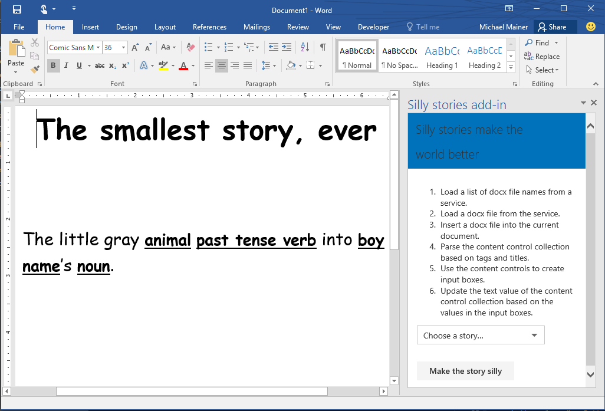

# <a name="silly-stories-word-add-in-sample-load-files-and-use-content-controls"></a>Silly stories Word アドイン サンプル: ファイルの読み込みとコンテンツ コントロールの使用

この Word アドインでは、以下を実行する方法が示されます。

1. サービスから docx ファイルのリストを読み込み、オプションとしてドロップ ダウン ボックス コントロールにファイル名を設定します。
2. サービスから docx ファイルを読み込み、それを Word 文書に挿入します。
3. コンテンツ コントロール コレクションを読み込み、コンテンツ コントロールに基づいて入力ボックスを作成します。
4. 入力ボックスの値に基づいてコンテンツ コントロール コレクションのテキスト値を更新します。
5. Office UI ファブリックを使用して、シームレスな Word ユーザー エクスペリエンスを作成します。

> 注: このサンプルの実行において、Silly stories (小話) の内容は副次的なものです。

## <a name="prerequisites"></a>前提条件

Silly stories Word アドイン サンプルを使用するには、以下が必要になります。

* [node.js](https://nodejs.org): docx ファイルを使用できるようにします。
* [npm](https://www.npmjs.com/): 依存関係をインストールします。
* JQuery: Office UI ファブリック [ドロップダウン](dev.office.com/fabric/components/dropdown) コンポーネントです。
* Word 2016、または Word Javascript API をサポートする任意のクライアント。このサンプルでは、サポートされているホストで実行されているか確認する要件チェックが実行されます。

## <a name="start-the-web-application"></a>Web アプリケーションの起動

1. コマンド ライン上のプロジェクトのルート ディレクトリで ```npm install``` を実行して、ノードのパッケージ マネージャー (npm) でプロジェクトの依存関係をインストールします。
2. プロジェクトのルート ディレクトリで ```node server.js``` を実行して、開発サーバーを起動します。アドインは 127.0.0.1:8080 で実行されます。

### <a name="configure-and-run-on-word-for-mac-2016"></a>Word for Mac 2016 での構成および実行

1. Users/Library/Containers/com.microsoft.word/Data/Documents/ に「wef」というフォルダーを作成します。
2. マニフェストを wef フォルダー (Users/Library/Containers/com.microsoft.word/Data/Documents/wef) に保存します。
3. Mac で Word 2016 を開き、[挿入] タブ > [マイ アドイン] ドロップ ダウンをクリックします。ドロップ ダウンにアドインがリスト表示されるはずです。選択すると、アドインが読み込まれます。

### <a name="configure-and-run-on-word-for-windows-2016"></a>Word for Windows 2016 の構成および実行

1. ネットワーク共有を作成するか、[ネットワークでフォルダーを共有し](https://technet.microsoft.com/ja-jp/library/cc770880.aspx)、そのフォルダーに [word-add-in-sillystories.xml](word-add-in-sillystories.xml) マニフェスト ファイルを配置します。この時点でアドインは展開されました。次に、Word がアドインを検索する場所を認識できるようにする必要があります。
2. Word を起動し、ドキュメントを開きます。
3. [**ファイル**] タブを選択し、[**オプション**] を選択します。
4. [**セキュリティ センター**] を選択し、[**セキュリティ センターの設定**] ボタンを選択します。
5. **[信頼されているアドイン カタログ]** を選択します。
6. **[カタログの URL]** ボックスに、word-add-in-sillystories.xml があるフォルダー共有へのネットワーク パスを入力して、**[カタログの追加]** を選択します。
7. **[メニューに表示する]** チェック ボックスをオンにし、**[OK]** を選択します。
8. これらの設定が Office を次回起動したときに適用されることを示すメッセージが表示されます。Word を終了して、再起動します。 

これで Word で実行する準備が整いました。 

1. Word 文書を開きます。 
2. Word 2016 の**[挿入]** タブで、**[マイ アドイン]** を選択します。 
3. **[共有フォルダー]** タブを選択します。
4. **[Silly stories アドイン]** を選択し、**[挿入]** を選択します。
5. **[ホーム]** タブに **[Word アドイン]** という新しいグループが表示されます。グループには **[Silly Stories]** というボタンがあります。(スクリーン ショットでは見えていません。)このボタンをクリックすると、アドインの作業ウィンドウが開きます。
6. ストーリーを選択すると、Word 文書に定型句が入力されます。

__図 1.Word に読み込まれた Silly stories アドイン__



## <a name="questions-and-comments"></a>質問とコメント

Silly stories Word アドイン サンプルについて、Microsoft にフィードバックをお寄せください。質問や提案につきましては、このリポジトリの「[問題](https://github.com/OfficeDev/Word-Add-in-SIllyStories/issues)」セクションに送信できます。

アドイン開発全般の質問については、「[Stack Overflow](http://stackoverflow.com/questions/tagged/Office365+API)」に投稿してください。質問またはコメントには、[office-js]、[word]、[API] のタグを付けてください。

## <a name="learn-more"></a>詳細を見る

Word JavaScript API ベースのアドインを作成するのに役立つその他のリソースを以下に示します。

* [iPad または Mac で Office アドインをサイドロードする](http://dev.office.com/docs/add-ins/testing/sideload-an-office-add-in-on-ipad-and-mac)
* 
  [Office アドイン プラットフォームの概要](https://msdn.microsoft.com/ja-jp/library/office/jj220082.aspx)
* [Word アドイン](https://github.com/OfficeDev/office-js-docs/blob/master/word/word-add-ins.md)
* [Word アドインのプログラミングの概要](https://github.com/OfficeDev/office-js-docs/blob/master/word/word-add-ins-programming-guide.md)
* [Word のスニペット エクスプローラー](http://officesnippetexplorer.azurewebsites.net/#/snippets/word)
* [Word アドインの JavaScript API リファレンス](https://github.com/OfficeDev/office-js-docs/tree/master/word/word-add-ins-javascript-reference)

## <a name="copyright"></a>著作権
Copyright (c) 2015 Microsoft.All rights reserved.
